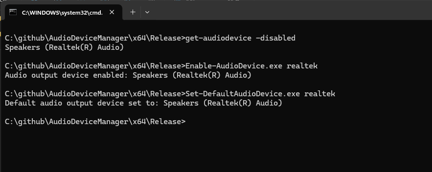

# AudioDeviceManager

v1.0.0

get-audiodevice - Lists the connected, enabled, audio output devices on the system.

set-defaultaudiodevice - Sets the default audio output device.
       Example: Set-DefaultAudioDevice "Speakers (Realtek High Definition Audio)"
       Substring matches are supported, e.g. Set-DefaultAudioDevice "polycom" 

## Screenshot

## Disclaimer

Reiterating the terms of the MIT release license:

THE SOFTWARE IS PROVIDED "AS IS", WITHOUT WARRANTY OF ANY KIND, EXPRESS OR
IMPLIED, INCLUDING BUT NOT LIMITED TO THE WARRANTIES OF MERCHANTABILITY,
FITNESS FOR A PARTICULAR PURPOSE AND NONINFRINGEMENT. IN NO EVENT SHALL THE
AUTHORS OR COPYRIGHT HOLDERS BE LIABLE FOR ANY CLAIM, DAMAGES OR OTHER
LIABILITY, WHETHER IN AN ACTION OF CONTRACT, TORT OR OTHERWISE, ARISING FROM,
OUT OF OR IN CONNECTION WITH THE SOFTWARE OR THE USE OR OTHER DEALINGS IN THE
SOFTWARE.
