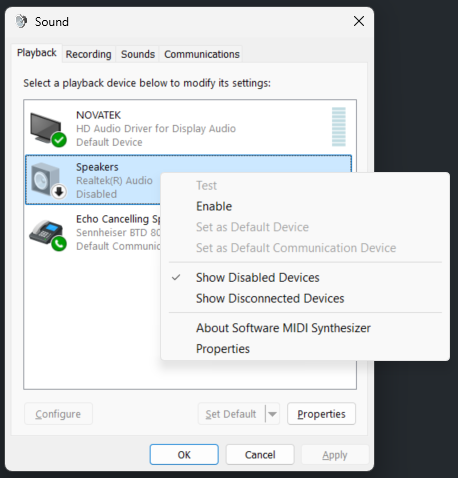

# AudioDeviceManager 

This is a collection of command-line utilities for managing Audio Devices in Windows, to automate the functions provided by the Sound Control panel, mmsys.cpl..  They can list devices, set the default devices, and enable/disable devices.

Replace this:



With this:


## Utilities
```
Get-AudioDevice.exe
  List audio devices on the system.
  -h: Display Help Message
  -input or -output displays input or output devices respectively.
  -disabled or -enabled displays disabled or enabled devices respectively.
  Running the executable with no options will display enabled output devices.

Get-DefaultAudioDevice
  Displays the Default audio output device.
   -h : Displays this help
   -sounds | -communications : Select the "role" to query
     sounds : Games, system notifications, Music, movies, narration, and live music recording.
     communications : Voice communications (talking to another person).
   -Input | -Output
     Displays the Input or Output device respectively.
  Running the executable with no options displays the default Multimedia output device.


Set-DefaultAudioDevice.exe
 Set-DefaultAudioDevice [-h] [-input|-output] [-sound|-communications] device_name
  Sets the Default sound or communications device.

 Syntax:
  -h (or with no options) : Displays this help
  -sounds | -communications : Select the "role" to set
    -sounds : Games, system notifications, Music, movies, narration, and live music recording.
    -communications : Voice communications (talking to another person).
  -Input | -Output
    Sets the Input or Output device respectively.
  device name : The name of the audio device to set as default.
    Substring matches are supported, e.g. "polycom" will match to the first device with polycom in the name.

  Running the executable with just a device name sets the default sound output device.
    Example: Set-DefaultAudioDevice "Realtek"

Enable-AudioDevice - Enables an audio device.

Syntax:
  Enable-AudioDevice device_name [-input | -output]
    Calling with no options displays this help message.
    -input | -output : Select to enable an input or output device.
    if -input or -output is not specified, the default is to enable an output device.
    device_name : The name of the audio device to enable.
  Example: Enable-AudioDevice "Realtek High Definition Audio" will enable that output device.
  Substring matches are supported, e.g. Enable-AudioDevice "polycom" -input will enable the first input device containing polycom in the name.


Disable-AudioDevice - Disables an audio device.

Syntax:
  Disable-AudioDevice device_name [-input | -output]
    Calling with no options displays this help message.
    -input | -output : Select to disable an input or output device.
    if -input or -output is not specified, the default is to disable an output device.
    device_name : The name of the audio device to disable.
  Example: Disable-AudioDevice "Realtek High Definition Audio)" will disable that output device.
  Substring matches are supported, e.g. Disable-AudioDevice "polycom" -input will disable the first input device containing polycom in the name.

```

## Disclaimer

Reiterating the terms of the MIT release license:

THE SOFTWARE IS PROVIDED "AS IS", WITHOUT WARRANTY OF ANY KIND, EXPRESS OR
IMPLIED, INCLUDING BUT NOT LIMITED TO THE WARRANTIES OF MERCHANTABILITY,
FITNESS FOR A PARTICULAR PURPOSE AND NONINFRINGEMENT. IN NO EVENT SHALL THE
AUTHORS OR COPYRIGHT HOLDERS BE LIABLE FOR ANY CLAIM, DAMAGES OR OTHER
LIABILITY, WHETHER IN AN ACTION OF CONTRACT, TORT OR OTHERWISE, ARISING FROM,
OUT OF OR IN CONNECTION WITH THE SOFTWARE OR THE USE OR OTHER DEALINGS IN THE
SOFTWARE.
